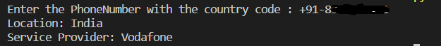

# PhoneNumber Geolocation and Service Provider Finder

This tool fetches the geographical location and service provider of a phone number and plots that location on a map using the Folium library.

## Details

To make this tool work, several Python modules need to be installed. They provide functionalities like parsing phone numbers, geocoding, and map generation.

### Modules to be installed:

- `phonenumbers`
- `folium`
- `opencage`

You can install these modules using: pip install phonenumbers folium opencage

## Features

1. **Phone Number Parsing**: Detects the location and service provider associated with a given phone number.
2. **Geocoding**: Converts a location name to its corresponding latitude and longitude using the OpenCage Geocoding API.
3. **Map Generation**: Creates an interactive map marking the location.

## Getting Started

1. **Clone the Repository**: git clone <repository-link>
2. **Install Required Modules**:pip install phonenumbers folium opencage
3. **Setup API Key**: Save your OpenCage API key as an environment variable or modify the code to read it from a secure location.

## How to Use

1. Run the main script: python Tracker.py
2. Input the phone number with the country code when prompted.
3. If valid, the script will display the location and service provider. It will also generate an HTML file (`Location.html`) containing the map with the marked location.

## Screenshots

## Contributions

Contributions, bug reports, and pull requests are welcome on GitHub at `https://github.com/Bisalkumar/Phone-Number-Tracker.git`. This project intends to be a safe, welcoming space for collaboration.

## License

This project is licensed under the MIT License - see the `LICENSE.md` file for details.

## Acknowledgments

- Thanks to the developers of `phonenumbers`, `folium`, and `opencage` for providing these excellent tools.
